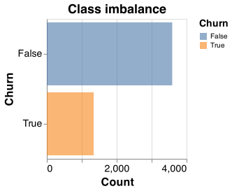

```{r setup, include=FALSE}
knitr::opts_chunk$set(echo = TRUE)
library(knitr)
library(tidyverse)
```

# Audience Persona

Two personas for potential audiences of Report on customer attrition for telecom companies:

 - Marla is the Head of Marketing at Telus. She has a good understanding of the telecom market in Canada and is responsible for  increasing sales revenue at Telus. She does not understand the nuances of machine learning concepts but she believes that data analytics can help her in refining the customer engagement strategy. She wants to know which factors her team needs to focus on in order to increase brand loyalty and achieve high customer retention.

 - Ann is a Data Science Manager at Telus. She analyzes data collected from multiple sources in order to provide most value generating insights to the company leadership. She is well versed with Machine Learning concepts and values her reputation as someone who provides reliable inputs. Lately, the company management has been asking a lot of questions from her regarding customer attrition. She wants to understand the assumptions, analysis, and results from this study, so that she can build on it further for her studies.

# Executive Summary

Telecom industry has been a fast-growing sector and service providers keep innovating in terms of tariff rates, contract structure and value-added-products to increase their customer base. However, due to presence of multiple service providers and relatively low switching cost, customer acquisition and retention remain expensive. An important business goal for telecom companies it to reduce customer `Churn`, which is the incident of customer ending their relationship with the company. This study examines the association of customer churn with multiple factors, such as demographics, services offered by the company, billing, and contract structure. Demographic factors considered in the study included whether the customer is a Senior Citizen, has a Partner, and had Dependents. Contract structure included length of contract, tenure of association and average billing charges. Other factors included the range and quality of services that the customer availed from the company, such as technical support, payment method options, and device protection.

This study revealed that an important factors influencing customer churn is the contract duration. Customers with shorter contract durations (monthly contract vs two-year contract) were more likely to leave. The study revealed that customers connected to fibre optic network and without online security were also more likely to churn. The study revealed that increase in tenure of relationship is associated with lower Churn, so risk of attrition reduces after a customer has spend more time with the company. The study also revealed that individuals who are senior citizens and have no partners or dependents are more likely to churn but the impact of these demographic factors is not too significant. 

Using these factors, we built a logistic regression model to predict which customers are likely to churn. In this problem it was important to minimize the instances of False Negatives (i.e. instances when model failed to identify customers likely to churn). This is because the company would need to focus of retaining customers that are at borderline. Hence, we used recall score as the model evaluation metrics. After training and optimization, we achieved a recall score of 0.82. While we achieved a good recall score, few other machine learning concepts, such as feature engineering, feature selection, resampling techniques and deep learning models, can be evaluated to improve prediction score further.

#### Keywords

customer churm, telecom, logistic regression, recall

# Introduction

Customer churn, the risk of customers switching to another company, is considered one of the most significant threats to the revenue of telecom company. (@pustokhina2021multi) The average churn rate in the telecom industry is approximately 2.2% per month, which translates to discontinued service for approximately one in four subscribers annually. It is known that the cost of acquiring new customers is significantly higher than the cost of retaining them (@pustokhina2021multi). Thus, reducing churn rate and increasing customer retention is a key strategic and financial goal for the telecom companies. 

Online resources offer open-source customer churn data that has been submitted by certain telecom companies. This data is clean but does not involve any transformation. Also, multiple data columns are categorical which would mean that we would get a sparce data representation after applying transformations. The existing work done on this data-set has been focused on understanding the customer profiles. This includes exploratory data analysis for customer segments and business trends. These analyses give a good insights into the telecom market segments but do not help the companies in preemptively working towards customer retention.

In our study, we have focused on identifying the main factors that impact customer attrition. Our goal was to come up with a list of parameters that would flow into the marketing strategy. Answering this question has important practical managerial implications for telecommunication companies because it is a crucial step in understanding how to reduce the Churn risk and thus create higher customer lifetime value. Further, we have also built a Machine Learning model for predicting customer churn based on the identified factors. This would be useful for preventive intervention for customers having high likelihood for Churn.

We considered this study as a classification problem with two response categories (positive is Churn = True, negative is Churn = False). To conduct the study, we first carried out data analysis where it was noted that there was class imbalance with reference to the response class (Churn = True/ False). We then evaluated multiple Machine Learning models and selected LogisticRegression based on performance accuracy and speed.

While our approach gave reliable score of 0.82, we believe that further performance improvement can achieved by incorporating feature engineering, feature selection, re-sampling techniques and deep learning models. 

# Methods

### Data

The data-set we used comes from the public IBM github page. As per the source, this data was provided by a telecom service provider in USA. However, the identity of customers and company name has been masked due to privacy reasons. The raw data is [here](https://raw.githubusercontent.com/IBM/telco-customer-churn-on-icp4d/master/data/Telco-Customer-Churn.csv).

The raw data comprises of 4930 rows and 20 columns. Each row in the dataset corresponds to information about a single customer. The columns represent 19 features, along with the target column, "churn". The target “churn” is a binary response variable which take the following values:  


 -	No, when customer churn is not detected
 -	Yes, when customer churn is detected

On preliminary analysis, it was noted that the data-set had class imbalance for the target variable and the class of interest (churn = Yes) was present in just over 25% observations. 

The other feature columns include:

1)	Demographic features (3)
  - Senior Citizen: Indicates if the customer is 65 or older: Yes, No
  - Partner: Indicate if the customer has a partner: Yes, No
  - Dependents: Indicates if the customer lives with any dependents: Yes, No. 
  
2)	Numeric features (3)
 - Monthly Charge: Indicates the customer’s current total monthly charge for all their services from the company
 - Total Charges: Indicates the customer’s total charges, calculated to the end of the quarter specified above
 - Tenure: Indicates the total months that the customer has been with the company 

3)	Categorical features (12)
 - Gender: Indicates if the sex a customer identifies with: Male, Female 
 - Phone Service: Indicates if the customer subscribes to home phone service: Yes, No
 - Multiple Lines: Indicates if the customer subscribes to multiple telephone lines: Yes, No
 - Internet Service: Indicates if the customer subscribes to Internet service: No, DSL, Fiber Optic, Cable.
 - Online Security: Indicates if the customer subscribes to additional online security service: Yes, No
 - Online Backup: Indicates if the customer subscribes to an additional online backup service: Yes, No
 - Device Protection: Indicates if the customer subscribes to an additional device protection plan: Yes, No
 - Tech Support: Indicates if the customer subscribes to an additional technical support plan: Yes, No
 - Streaming TV: Indicates if the customer uses their Internet service to stream television programing from a third party provider: Yes, No
 - Streaming Movies: Indicates if the customer uses their Internet service to stream movies from a third party provider: Yes, No
 - Contract: Indicates the customer’s current contract type: Month-to-Month, One Year, Two Year.
 - Paperless Billing: Indicates if the customer has chosen paperless billing: Yes, No
 - Payment Method: Indicates how the customer pays their bill: Bank Withdrawal, Credit Card, Mailed Check

### Data Cleaning and Preprocessing

The data used for this study was relatively clean, which means that there were no erroneous values or duplicate representation of categories. However, there were some missing values and inconsistent datatypes in the feature columns. Before conducting any pre-processing, the data was split into train and test sets in the ratio of 70:30. This was done so that the test data dis not influence the model performance and evaluation. This would further ensure that the results on test data were representative of expected model performance on unseen data. 

For data pre-processing, we first dropped the `gender` column from the data. This was done to avoid any gender related bias that may go into the analysis. This bias could negatively affect one group or the other.

We then made the data types consistent with the model requirement. `Total Charges` was converted from string to numeric. Target `Churn` was converter from string to Boolean. Following this, we identified missing values and out-liers. We noticed that missing values were present in the `Total Charges` column only and it for 0.01% observations. So, we imputed these values using the formula: `Total Charges = 12 times Monthly Charges`. We did not observe any out-liers in the data.

We further transformed the data according to the data-type. We normalized the numeric columns to make sure that the feature importance is not dependent upon the scale of the variable. We encoded the categorical features using One-Hot Encoding, so that all columns are represented using numbers and we can use them for data modeling.

Further exploratory data analysis was conducted on the pre-processed and transformed data to identify key features and variables of interest. This is covered in the subsequent section. 

### Data Analysis

The data analysis was carried out to understand the nature of data and identify potential variables of interest. This was done on training data only and the test data was left unexposed.

We first evaluated class imbalance and observed that the target variable has only 25% observations for the category of interest. This meant that the number of observations with Churn as `True` was just over 25%. Due to non-availability of additional data, we decided to retain the imbalanced data but addressed the issue of class imbalance using an appropriate model evaluation metric. In the prediction part of this study, it was imperative to minimize instances where the model fails to predict possible churns. This meant that we needed a high recall score [Recall score represents the ratio of Correctly Predicted Positives to Total Positives, where positive represents Churn=True). The class imbalance is shown in the plot below:

```{r class imbalance, echo=FALSE, fig.cap = "Figure 1: Distribution of response variable shows class imbalance", out.width = '25%', fig.align="center"}

```

We then segregated the features as numerical and categorical variables. 

For numerical variables, we looked into the distribution of these features for the two target classes. It was observed that `Tenure` shows clear split between the two response classes, where as the other two features `Monthly Charges` and `Total Charges` do not provide a clear bifurcation between th two response classes. Hence, `Tenure` feature seems to be important where as `Monthly Charges` and `Total Charges` do not look important.

```{r numerical features distribution, echo=FALSE, fig.cap = "Figure 2: Distribution of numerical features for response variable indicates that Tenure may be important for prediction", out.width = '100%', fig.align="center"}

```

We also analyzed the correlation between the three numerical features. Here, it was observed that there is high positive correlation between `Tenure` and `Total Charges`. The correlation between numeric features is an important consideration while interpreting the model. In case, any two features are highly correlated, we may have to merge them together or drop one of them to improve model performance. This correlation is represented using a heat-map, which gives correlation values and color codes.

```{r numerical features correlation, echo=FALSE, fig.cap = "Figure 3: Correlation chart for numerical features shows high correlation between input variables, Tenure and Total_charges", out.width = '40%', fig.align="center"}

```

We observed the distribution of categorical features pertaining to demographics. From the bar charts, we can pick out the categories which have a higher ratio of positive class (Churn="True"). It can be observed that people with no dependents, no partner and senior citizens had a slightly higher Churn.

```{r categorical demographic features, echo=FALSE, fig.cap = "Figure 4: Distribution of response variable for demographic features indicates Partner(Y/N) may be important for prediction", out.width = '35%', fig.align="center"}

```

We did further analysis of distribution of categorical features pertaining to Telecom Company services. In these, we observed the categories for which there were higher number of positive classes (Churn = "True"). It was noted that for various features, the following categories have higher Churn rate: Internet Service (Fiber Optic service), Contract (Monthly), Online Security (No), Online Backup (No), Payment Method (Electronic Check), Paperless Billing (Yes), Tech Support (No), Device Protection (No).

### Model Implementation and Predictions

For data modeling, we used the Python language[@Python] and following Python packages: docopt [@docopt], os [@Python], scikit-learn [@scikit-learn], Pandas [@reback2020pandas], Numpy Array[@2020NumPy-Array], matplotlib [@hunter2007matplotlib]and altair [@vanderplas2018altair]. 

We used the pre-processed and transformed data as input for our models. As has been mentioned above that train test split was in the ratio of 70:30 and this was done before exposing the data to any pre-processing or transformations. It was also noted above that to handle class imbalance, we decided to use an appropriate evaluation metric (recall score) instead of any re-sampling techniques. This was done due to lack of resources required for re-sampling.

Using this data, we first established the baseline using sklearn's `DummyClassifier`. The baseline accuracy was 0.73 and the baseline recall value was 0.0. This happened because the DummyClassifier uses `most frequent` strategy and predicted all responses as Churn=False and was not able to correctly predict any Churn=True observations.

We then trained LogisticRegression, KNN and RandomForest models for classification. All these models are used for classification of response variable. In our analysis, we observed that the RandomForest model had the highest recall score of 0.83 where as LogLogisticRegression had a recall score of 0.81. However, the fit time for RandomForest model was approximately 5 times higher than that of LogisticRegression. Hence, we selected LogisticRegression model for further implementation. The kNN model had a low  score of 0.74,so , it was not evaluated further.

We then optimized the parameters of the LogisticRegression model by mathematically searching in the space of  possible values. This hyperparameter optimization was carried out using sklearn's `GridSearch` approach with 4 cross validation folds, over hyper parameters `C` & `class_weight`. This yielded optimal parameters `C=0.01` and `class_weight="balanced"`and resulted in improved recall score of 0.82. 

# Results and Discussion

From the data analysis, we observed that certain features have a high positive correlation with customer churn rate i.e. the presence of these factors may be associated with higher likelihood of customer churn. These features are:

```{r positive feature importance, echo=FALSE, message=FALSE, warning=FALSE, fig.align="center"}
read_csv("../results/feature_importance.csv") |> 
  arrange(desc(Coefficient)) |> 
  head(5) |> 
  mutate_if(is.numeric, round, 2) |>
  knitr::kable(caption = "Table 2: Summary of features most positively correlated with Churn") 
```

Similarly certain features have a high negative correlation with Customer Churn i.e. presence of these factors supports Customer Retention. These features are:

```{r, echo=FALSE, warning=FALSE, message=FALSE, fig.align="center"}
read_csv("../results/feature_importance.csv") |> 
  arrange(Coefficient) |> 
  head(5) |> 
  mutate_if(is.numeric, round, 2) |>
  knitr::kable(caption = "Table 3: Summary of features most negatively correlated with Churn") 
```

These feature importance's make sense intuitively, as customers on month-to-month contracts are much more likely to churn than customers on two year contracts. One surprising result is that customers with fibre optic internet service are much more likely to churn than customers with DSL internet service. As a result, the pricing strategy and quality of service for the fibre optic internet service may need to be reconsidered. Higher monthly charges, electronic check payments, and no online security services were all also predictors of customers leaving the company.

Conversely, longer tenured customers are less likely to leave, along with those on a two year contract, using DSL internet service, using online security services, and those requiring tech support. In these cases, we can recommend that the company consider promoting two year service contracts, promoting online security services, as well as promote the companies tech support to solve any issues customers may have. Clearly, those who use the companies tech support are satisfied with the service and well be less likely to leave. Tech support accessibility should also be better communicated, such that customers understand where to go when they need help.

Given the business problem that our prediction algorithm is trying to solve, it was more important for us to be able to identify the Churn class correctly (to minimize false negatives). This is because it is very costly for company to loose customers and attract new ones, and much less costly to keep them. Therefore we want our model to make more false positives than false negatives, in order to avoid the cost of miss classifying a leaving customer. As evidenced by the confusion matrix below, our model made 413 false positives and only 97 false negatives:

```{r confusion matrix, echo=FALSE, message=FALSE, fig.cap = "Figure 6: Confusion Matrix shows low number of False Negatives", out.width = '45%', fig.align="center"}

```

While we achieved a decent recall score of \~0.82, further work should be done to optimize the model before we can recommend deploying it. We should test other Machine Learning techniques such as feature engineering, feature selection, data re-sampling, and testing other models to get a robust model for predictions.

# Conclusion

Based on the results, we see that demographic factors do not have a very high impact on Customer Churn rate. This inference can help in defining a universal marketing strategy and shows that the company does not need to highly customize its offerings for each customer segment. It also implies that Churn rate depends primarily upon the the factors, such as contract structure and services, that can be influenced by the company. It highlights that the company can work on the following aspects of customer relationship to increase retention:
 - Incentivise customers to enter into two-year contracts instead of month-on-month contracts
 - Incentivise customers to opt for Technical Support and Online Security to customers
 - Changing internet service technology from Fibre Optic to DSL over time

Despite limitations and room for future improvements, our results show that this model that can be utilized by telecom companies to better predict their customer churn rate based on respective customer characteristics. This provides motivation to put more work in this study for getting more robust outcomes. 

# Github Repos

- Telco customer churn project repo: https://github.com/Anupriya-Sri/Telco_Customer_Churn_Prediction
- Lab2 repo: https://github.ubc.ca/mds-2021-22/DSCI_542_lab2_anuinbox

# References
